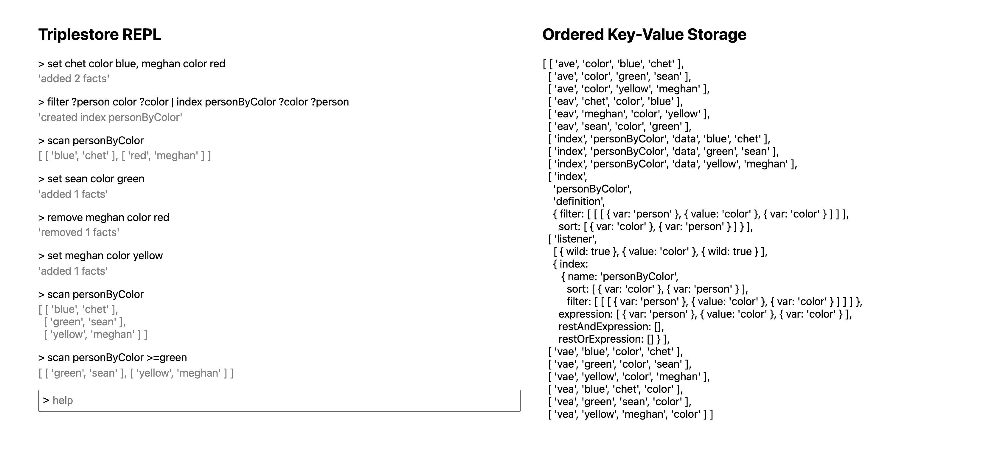

# Triplestore REPL

[Live App](https://ccorcos.github.io/triplestore-repl)

This is a simple application with a DSL for playing with the [`triple-database`](https://github.com/ccorcos/triple-database/)



## Examples to try yourself

### Basic logical queries

Suppose we have a bunch of people and those people have colors associated with them.

```
set chet color blue
set sean color green
```

We can write some basic queries:

```
filter chet color ?color
```

And a person can have more than one color!

```
set chet color red
filter chet color ?color
```

We can also lookup all people and their colors

```
filter ?person color ?color
```

In an application, we might want to be able to lookup users by color a lot. We can get a list of all users and their colors ordered by color:

```
filter ?person color ?color | sort ?color ?person
```

But to do this efficiently, we'll want to create an index.

```
filter ?person color ?color | index personByColor ?color ?person
```

Now we can scan over this index:

```
scan personByColor
```

The syntax here is a bit involved.
- `=tuple` is a prefix
- `>tuple` is gt, `>=tuple` is gte, `<tuple` is lt, `<=tuple` is lte
- `-` is reverse
- `!n` is limit.
- the `MAX` and `MIN` keywords are useful for the comparison tuples (you probably don't need this).

So suppose we want to know all the users with the color blue. We can use the prefix for that.

```
scan personByColor =blue
```

This index gets updated automatically when new data is written to the database:

```
set joe color blue
scan personByColor =blue
```

### Basic index scanning

Now suppose each person has a score.

```
set chet score 4, meghan score 15, sean score 7
```

We want to be able to keep track of the top scorers:

```
filter ?person score ?score | index leaderboard ?score ?person
scan leaderboard
```

But the leaderboard is low-to-high. Unfortunately, we don't have the ability to change the sort direction or each column. This is currently a limitation and has to do with the fact that it's not possible to encode any values in a manner that sorts them the other way. You could instead use a negative score and deal with the minus sign in your application. Or we can simply scan backwards which is efficient using binary search under the hood!

For example, we can very efficiently lookup the top scorer:

```
scan leaderboard - !1
```

And this will update as we change data as well

```
remove chet score 4
set chet score 99
scan leaderboard - !1
```

But lets say we want to know the score of everyone with between 5 and 10?

```
scan leaderboard >=5 <=10
```

Lastly, we can use this kind of comparison to paginate.

Lets add some more scores to make this interesting.

```
set joe score 99, andrew score 99
```

Now suppoe we want to get the top score paginated one at a time.

This will get us the first one:

```
scan leaderboard - !1
```

Then to get the second one, we just need to use the result with less-than:

```
scan leaderboard - !1 <99 joe
scan leaderboard - !1 <99 chet
scan leaderboard - !1 <15 meghan
scan leaderboard - !1 <7 sean
```

### Indexing two-way friend relationships

Suppose we have a "friend" relationship between people.

```
set chet friend sean, chet friend andrew, meghan friend chet
```

Note that this relationship is currently only one directional. Rather than have to denormalize the data and write the relationship both ways, we can use an OR query to do this for us.

```
filter ?person friend ?friend; ?friend friend ?person | sort ?person ?friend
```

Pretty neat. We can create an index now and make it easy to lookup a person's list of friends.

```
filter ?person friend ?friend; ?friend friend ?person | index friends ?person ?friend
scan friends =chet
```

As expected, the index updates accordingly.

```
set joe friend chet
scan friends =chet
```

### Indexing a social graph

One of the most frustrating things about SQL databases is how you cannot index a "twitter feed" on a normalized data model. But you can with this triplestore!

Here's a small social graph of people following each other.

```
set chet follows meghan
set andrew follows meghan
set chet follows andrew
set meghan follows andrew
```

Now lets create some posts.

```
set post1 author chet, post1 datetime "2021-10-18 12:00", post1 text "hello world"
set post2 author meghan, post2 datetime "2021-10-18 12:01", post2 text "this is meghan"
set post3 author andrew, post3 datetime "2021-10-18 12:03", post3 text "hello from andrew"
set post4 author meghan, post4 datetime "2021-10-18 12:04", post4 text "second post from meghan"
```

We can add a bunch more but this should be good for now.

Now let's query for a user's feed:

```
filter chet follows ?person, ?post author ?person
```

Cool, now we just want to order it by datetime:

```
filter chet follows ?person, ?post author ?person, ?post datetime ?datetime, ?post text ?text | sort ?datetime ?person ?text
```

Lets create an index so we can see the feed for every user:

```
filter ?user follows ?person, ?post author ?person, ?post datetime ?datetime, ?post text ?text | index feed ?user ?datetime ?person ?text
scan feed =chet
```

Sweet! Now what happens when someone adds another post?

```
set post5 author andrew, post5 datetime "2021-10-18 12:07", post5 text "does it work?"
scan feed =chet
```

What about following and unfollowing?

Meghan doesn't currently follow chet:

```
scan feed =meghan
```

Let's try it:

```
set meghan follows chet
scan feed =meghan
```

Half of chet's feed is meghan, lets try unfollowing.

```
scan feed =chet
remove chet follows
scan feed =chet
```

Well there you have it! Go build something cool! 🍉
